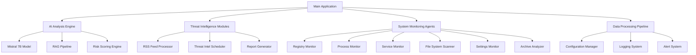
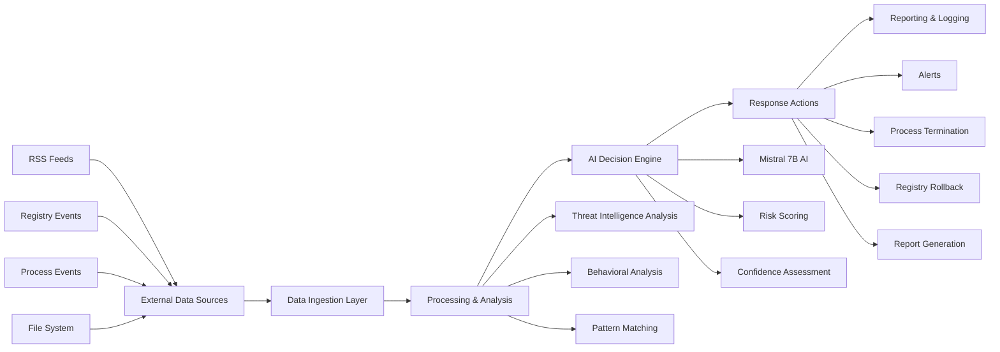

# Guardrail System

A comprehensive security monitoring and threat detection platform that leverages AI-powered analysis to identify and respond to potential security threats in real-time.

## Overview

Guardrail System is an advanced security solution that combines multiple monitoring modules with AI-powered threat intelligence to provide comprehensive protection for Windows systems. The system monitors registry changes, process behavior, system services, file activities, and system settings to detect potential security threats.

The system uses the Mistral 7B model via Ollama for intelligent threat analysis, enhanced with real-world malware examples from the Avast CTU CAPEv2 dataset to improve detection accuracy. It implements a Retrieval-Augmented Generation (RAG) pipeline to provide context-aware threat analysis.

## Key Features

### AI-Powered Threat Detection
- Utilizes the Mistral 7B model via Ollama for advanced threat analysis
- Integrates with the Avast CTU CAPEv2 dataset to enhance AI decision-making with real-world malware examples
- Implements Retrieval-Augmented Generation (RAG) to provide context-aware threat analysis
- Features dual analysis modes:
  - Threat Intelligence Analysis for RSS feeds
  - File Content Analysis for archive scanning
- AI risk scoring for registry events with explainability

### Multi-Layered Monitoring
- **Registry Monitoring**: Real-time monitoring of registry changes using ETW (Event Tracing for Windows)
- **Process Monitoring**: Tracks running processes and identifies suspicious behavior
- **Service Monitoring**: Monitors system services for unauthorized changes
- **File System Scanning**: Scans files and directories for potential threats
- **Archive Analysis**: Deep scanning of compressed archives for malicious content
- **Settings Monitoring**: Monitors critical system settings for unauthorized changes

### Threat Intelligence Integration
- Processes RSS feeds from leading security sources (Malwarebytes, CrowdStrike, Krebs on Security, etc.)
- Automatically updates monitoring configurations based on latest threat intelligence
- Deduplicates processed articles to avoid redundant analysis
- Generates actionable reports with confidence scoring
- Suggests applications for removal based on security threats

### Real-Time System Metrics
- CPU/GPU usage monitoring with visual indicators
- Temperature monitoring for system health
- RAM and storage utilization tracking
- Ollama service status monitoring with visual feedback

## System Architecture



### Core Components

1. **Main Application** ([main.py](main.py)): Central UI and system coordinator
2. **AI Engine** ([ai/](ai/)): Mistral 7B integration with RAG pipeline
3. **Registry Monitoring** ([registry/](registry/)): ETW-based registry change detection
4. **Process Monitoring** ([monitor/process_monitor.py](monitor/process_monitor.py)): Real-time process tracking
5. **Service Monitoring** ([service_monitor.py](service_monitor.py)): System service surveillance
6. **File Analysis** ([system_scan.py](system_scan.py), [advanced_archive_scanner.py](advanced_archive_scanner.py)): Comprehensive file scanning
7. **Settings Monitoring** ([monitor/settings_monitor.py](monitor/settings_monitor.py)): Critical system settings surveillance

## Data Flow Diagram



## Dashboard Preview

```
┌─────────────────────────────────────────────────────────────┐
│                    GUARDRAIL SYSTEM DASHBOARD               │
├─────────────────────────────────────────────────────────────┤
│ STATUS: ACTIVE        AI ENGINE: ONLINE        RSS FEEDS: 7 │
├─────────────────────────────────────────────────────────────┤
│                                                             │
│  [■■■■■■■■■■■■■■■■■■■■■■■■■■■■■■■■■■■■■■■■] CPU: 24%       │
│  [■■■■■■■■■■■■■■■■■■■■                    ] RAM: 52%       │
│  [■■■■■■■■■■■■■■■■■■■■■■■■■■■■■■■■■■■■■■■■] GPU: 18%       │
│  [■■■■■■■■■■■■■■■■■■■■■■■■■■■■■■■■■■■■■■■■] TEMP: 42°C    │
│                                                             │
├─────────────────────────────────────────────────────────────┤
│ RECENT THREATS DETECTED                                     │
│ ┌─────────────────────────────────────────────────────────┐ │
│ │ HIGH: Registry modification in HKLM\Software\Microsoft  │ │
│ │ MED: Suspicious process launch (powershell.exe)         │ │
│ │ LOW: Unusual network connection from svchost.exe        │ │
│ └─────────────────────────────────────────────────────────┘ │
├─────────────────────────────────────────────────────────────┤
│ THREAT INTELLIGENCE UPDATES                                 │
│ Last Update: 2 hours ago                                    │
│ Next Update: 4 hours                                        │
│ Articles Processed Today: 24                                │
└─────────────────────────────────────────────────────────────┘
```

## Installation

### Prerequisites
- Windows 10/11 (with administrator privileges)
- Python 3.8 or higher
- Ollama with Mistral 7B model
- Git (for cloning the repository)

### Setup Instructions

1. Clone the repository:
   ```bash
   git clone https://github.com/AirbusA321NX/guardrail_system.git
   cd guardrail_system
   ```

2. Install dependencies:
   ```bash
   pip install -r requirements.txt
   ```

3. Install Ollama and the Mistral 7B model:
   ```bash
   # Download and install Ollama from https://ollama.com/
   ollama pull mistral:7b
   ```

4. Initialize the AI with security examples:
   The system automatically initializes the RAG pipeline with examples from the included Avast CTU CAPEv2 dataset.

## Usage

### Running the Main Application
```bash
python -m main
```

The application requires administrator privileges to access system temperature sensors and perform comprehensive monitoring.

### Running Individual Modules

#### Registry Monitor
```bash
python -m monitor.registry_monitor
```

#### Process Monitor
```bash
python -m monitor.process_monitor
```

#### Threat Intelligence Analyzer
```bash
python -m registry.threat_intel_analyzer
```

#### Application Threat Detection
```bash
python -m registry.app_threat_analyzer
```

#### Archive Scanner
```bash
python run_archive_scan.py
```

#### System Scanner
```bash
python system_scan.py [directory]
```

#### Settings Monitor
```bash
python -m monitor.settings_monitor
```

## AI Integration

The system leverages the Mistral 7B model through Ollama to provide intelligent threat analysis. The AI is enhanced with:

- **Retrieval-Augmented Generation (RAG)**: Context-aware responses using examples from the Avast CTU CAPEv2 dataset
- **Dual Analysis Modes**: Specialized processing for different threat types
- **Confidence Scoring**: Quantifiable trust metrics for AI decisions
- **Risk Scoring for Registry Events**: AI-powered risk assessment for registry changes

The system uses examples from the Avast CTU CAPEv2 dataset to provide real-world context to the AI model, enabling it to make more informed decisions about potential threats.

### AI Analysis Modules

1. **Mistral Analysis** ([ai/mistral_analysis.py](ai/mistral_analysis.py)): Core AI analysis engine with RAG pipeline
2. **Risk Scoring** ([ai/risk_scoring.py](ai/risk_scoring.py)): AI-powered risk scoring for registry events
3. **Static Analyzer** ([ai/static_analyzer.py](ai/static_analyzer.py)): Static file analysis with AI-powered threat detection
4. **Archive Scanner** ([advanced_archive_scanner.py](advanced_archive_scanner.py)): AI-powered analysis of archive files

## Configuration

All modules use YAML-based configuration files stored in the [registry/config/](registry/config/) directory:

- `registry_paths.yml`: High-value registry targets to monitor
- `process_iocs.yml`: Suspicious process indicators
- `commandline_patterns.yml`: Suspicious command line patterns
- `microsoft_allowlist.yml`: Microsoft-signed processes to filter out
- `system_noise.yml`: Benign system activity patterns to ignore

### Registry Monitoring Configuration

The registry monitoring system tracks over 100 high-value registry keys with different risk levels:
- Critical: System-wide startup programs, Windows logon configuration, Windows services
- High: User-specific startup programs, shell service objects, COM class identifiers
- Medium: Screen saver configuration, context menu handlers

### Process Monitoring Configuration

Process monitoring uses pattern-based detection for suspicious processes:
- Suspicious process names and behaviors
- Command-line pattern matching
- Parent-child process relationships

## Data Sources

### Threat Intelligence Feeds
The system processes RSS feeds from leading security sources:
- Malwarebytes Blog
- CrowdStrike Blog
- Krebs on Security
- Threatpost
- BleepingComputer
- CISA Alerts
- CERT-EU

### Dataset Integration
The system incorporates the Avast CTU CAPEv2 dataset to enhance AI analysis with real malware behavior examples. This dataset provides context for the AI to better identify potential threats.

The dataset is used to initialize the RAG pipeline with examples of:
- Registry modifications
- File access patterns
- Mutex creation
- Service creation
- Command execution
- Process creation
- Network connections
- File operations (write, delete, read)

## System Requirements

- **Operating System**: Windows 10/11 (64-bit)
- **Python Version**: 3.8 or higher
- **RAM**: 8GB minimum (16GB recommended)
- **Storage**: 500MB available space (1GB recommended for datasets)
- **Administrator Privileges**: Required for full functionality

## Dependencies

Key dependencies include:
- `psutil`: System and process utilities
- `wmi`: Windows Management Instrumentation
- `ollama`: AI model interface
- `PyYAML`: Configuration file handling
- `feedparser`: RSS feed processing
- `torch`: Machine learning framework
- `transformers`: NLP models
- `scikit-learn`: Machine learning algorithms
- `pefile`: PE file analysis
- `python-magic`: File type detection
- `py7zr`: 7z archive support
- `rarfile`: RAR archive support

See [requirements.txt](requirements.txt) for a complete list of dependencies.

## Security Features

### Real-Time Monitoring
- Event-driven monitoring instead of polling for better performance
- Comprehensive metadata collection including process information, binary hashes, and user context
- Wow64 detection for 32/64-bit registry hive monitoring
- Monotonic event IDs for tracking
- Complete telemetry schema with all required metadata

### Advanced Filtering
- Microsoft allowlists to reduce false positives
- Pattern-based filtering for processes, paths, and command lines
- System noise filtering to focus on relevant events
- Adaptive thresholds based on file characteristics

### Automated Response
- AI-powered risk scoring for detected threats
- Confidence-based decision making
- Detailed reporting with actionable recommendations
- Popup alerts for critical security events
- Structured logging for forensic analysis

### Threat Intelligence Integration
- Automatic configuration updates based on latest threat intelligence
- Deduplication of processed articles
- Application removal suggestions based on security threats
- Scheduled intelligence updates every 6 hours

## Development

### Project Structure
```
guardrail_system/
├── ai/                 # AI analysis modules
│   ├── mistral_analysis.py      # Core AI analysis engine
│   ├── risk_scoring.py          # Registry event risk scoring
│   └── static_analyzer.py       # Static file analysis
├── config/             # Configuration files
├── dataset/            # Security datasets
├── monitor/            # System monitoring agents
│   ├── process_monitor.py       # Process monitoring
│   ├── registry_monitor.py      # Registry monitoring
│   ├── settings_monitor.py      # System settings monitoring
│   └── advanced_archive_scanner.py  # Archive file analysis
├── registry/           # Registry monitoring components
│   ├── config/                  # Registry monitoring configuration
│   ├── etw_registry_monitor.py  # ETW-based registry monitoring
│   ├── threat_intel_analyzer.py # Threat intelligence processing
│   └── threat_intel_scheduler.py # Threat intelligence scheduling
├── utils/              # Utility functions
├── main.py             # Main application
├── requirements.txt    # Python dependencies
└── README.md           # This file
```

### Adding New Features
1. Extend detection logic by modifying YAML configuration files
2. Add new RSS feeds to threat intelligence modules
3. Implement new monitoring agents in the [monitor/](monitor/) directory
4. Enhance AI analysis by updating prompts in the [ai/](ai/) modules
5. Add new registry paths to monitor in [registry/config/registry_paths.yml](registry/config/registry_paths.yml)

### Configuration Files
- `registry_paths.yml`: Registry keys to monitor with risk levels and descriptions
- `process_iocs.yml`: Suspicious process indicators with tags and descriptions
- `commandline_patterns.yml`: Suspicious command line patterns with categorization
- `microsoft_allowlist.yml`: Microsoft-signed processes to filter out system noise
- `system_noise.yml`: Benign system activity patterns to ignore

## Contributing

1. Fork the repository
2. Create a feature branch
3. Commit your changes
4. Push to the branch
5. Create a pull request

## License

This project is licensed under the MIT License - see the LICENSE file for details.

## Acknowledgments

- Mistral AI for the Mistral 7B model
- Ollama for the local AI deployment solution
- Avast for the CTU CAPEv2 dataset
- The security research community for threat intelligence feeds